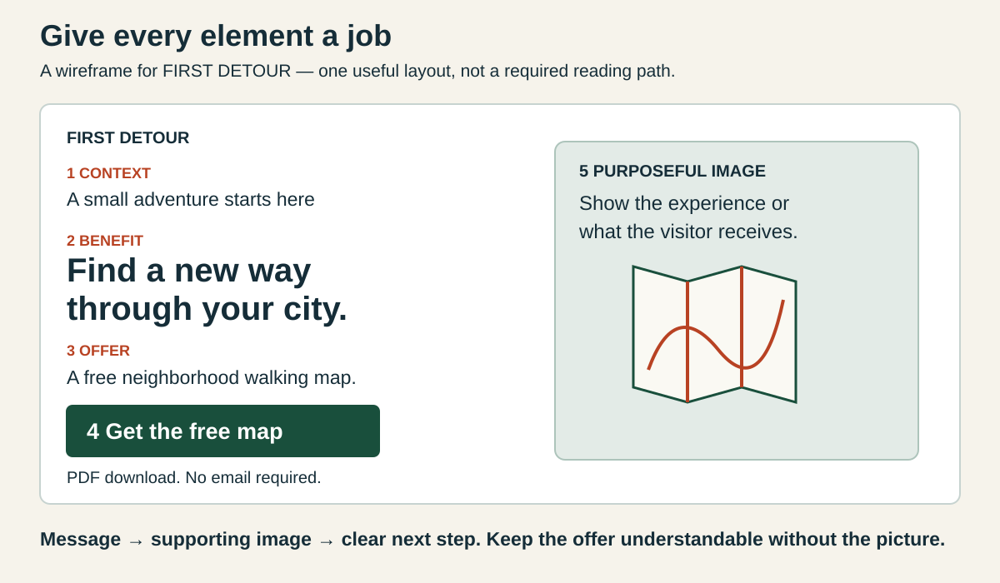

# 1. Build a hero that has a job

[Home](../README.md) · [Assignment](../assignment.md) · [Next: research and style →](02-research-and-style.md)

**You will learn:** how a hero brings this assignment's concepts together.

## Start with the visitor's decision

A hero is the prominent introductory section of a webpage. It should help someone answer:

1. What is this?
2. Why is it relevant to me?
3. What can I do next?

A dramatic image can attract a glance while leaving all three unanswered. Start with the message, then choose the image.

This is one useful arrangement, not a mandatory reading path. People scan differently.

## Give each concept its own job

| Decision | What it controls | FIRST DETOUR example |
|---|---|---|
| Audience | Whose need you address | City residents seeking local adventure |
| Archetype | Motivation and voice | Explorer: curiosity and discovery |
| Persuasion | A reason to take the next step | Reciprocity: give a useful free map first |
| Design style | Organization and visual language | Swiss grid or Memphis-inspired play |
| Image medium | How you represent the idea | Photograph, illustration, or product view |
| CTA | What happens next | Get the free map |

An archetype is a creative framework, not a diagnosis. A smiling face does not automatically demonstrate “liking,” and geometric shapes do not automatically make a design modernist. Explain the connection.

## Write the message before making the picture

**Vague:** “Discover more.” Button: “Click here.”

**Specific:** “Find a new way through your city.” Supporting copy: “Take a different turn with a free neighborhood walking map.” Button: “Get the free map.”

The headline expresses curiosity, the supporting copy identifies the offer, and the button names the deliverable. “PDF download. No email required” explains what to expect—only use it if true.

Other hypothetical briefs:

| Archetype | Visitor need | Headline → CTA |
|---|---|---|
| Sage | Understand unfamiliar material | “Make sense of your first research paper.” → “Read the annotated example” |
| Caregiver | Feel supported starting a task | “Your first week, one manageable step at a time.” → “Get the starter checklist” |
| Creator | Find a starting point | “Give your next idea a place to begin.” → “Download the sketch prompts” |

These are creative proposals, not measured performance claims.

## Try it in your package

Write: **“For [audience], our [archetype] brand offers [specific value]. The visitor should [action].”**

Draft the headline, supporting sentence, and button as plain text. Ask a teammate to explain the offer before you generate an image.

**Carry forward:** put this brief at the top of your archetype page.
