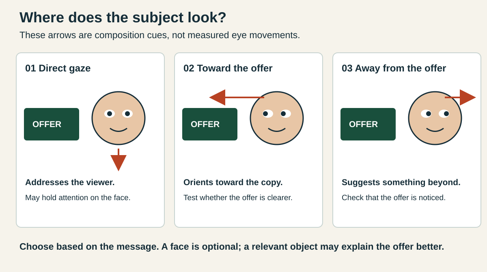
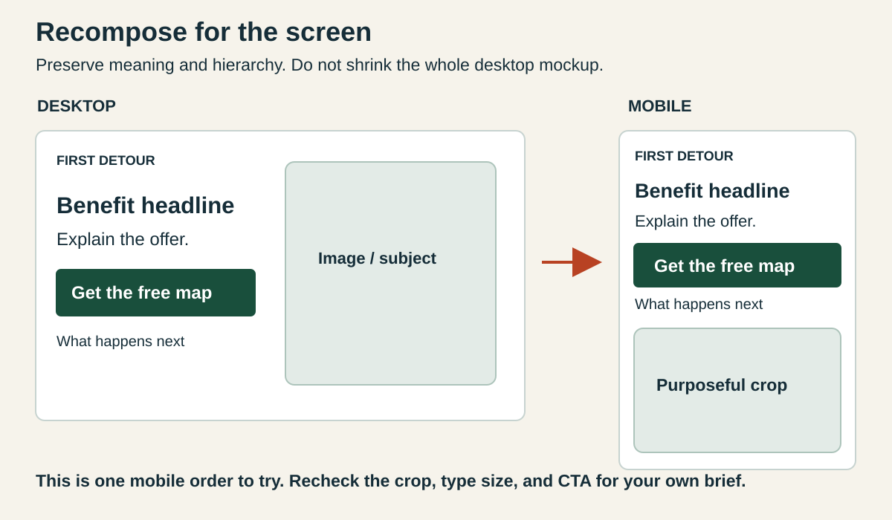

# 3. Direct attention with imagery

[← Research and style](02-research-and-style.md) · [Home](../README.md) · [Next: CTAs →](04-persuasion-and-cta.md)

**You will learn:** when a face helps, where gaze can lead, and how to choose photography or illustration.

## A face can compete with the message

Faces convey expression and social information. In one banner-ad experiment, faces attracted attention; direct gaze concentrated attention on the face, while gaze toward advertised content helped direct attention to the message. These results came from particular banner layouts, not every hero. [Read the 2014 study](https://www.frontiersin.org/journals/psychology/articles/10.3389/fpsyg.2014.00166/full).

Another study found gaze effects on attention and purchase intention, but not product attractiveness or willingness to pay. **Attention is not proof of clicks or sales.** Treat these findings as design hypotheses. [Read the 2017 study](https://www.frontiersin.org/journals/psychology/articles/10.3389/fpsyg.2017.00881/full).

Try direct gaze for personal connection, inward gaze to orient toward an offer, and outward gaze for a story about distance or exploration. Check whether the copy gets lost. These are hypotheses, not universal rankings.

A hand, road, diagonal, or product angle can also suggest direction. Faces are optional: a useful product view can explain more than a decorative portrait.

## Photograph, cartoon, or object?

| Choice | Useful for… | Watch for… |
|---|---|---|
| Real photograph | Actual people, products, places, detail | Accuracy, permission, distracting backgrounds |
| AI photographic image | A realistic-looking concept | Invented details; label it generated, not documentary proof |
| Cartoon / editorial illustration | Metaphor, simplification, distinctive voice | Generic characters or audience mismatch |
| Object / interface view | Showing what the visitor receives | Tiny or ambiguous objects that need explanation |

A cartoon can be professional. A photograph can be playful. **Image medium and design movement are separate choices**: the [gallery](05-example-gallery.md) shows all four combinations.

For the later T-shirt project, a photo can demonstrate the actual garment's fit and texture; a cartoon can communicate its attitude. A generated garment cannot establish what a real product looks or feels like.

## Compose the whole hero

Reserve space for copy. Choose a purposeful crop; avoid letters across faces or detailed backgrounds. For a narrow screen, reconsider crop and stacking order instead of shrinking the desktop screenshot.

## Try it in your draft

Sketch the same copy with direct gaze, inward gaze, and no face. Ask a teammate what they noticed and what they think the offer is. Choose what best explains your brief.

**Carry forward:** explain the image choice in your revision note. Do not claim you measured eye movements.
