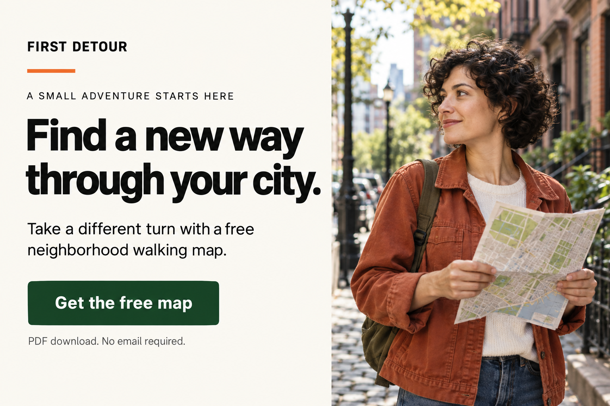
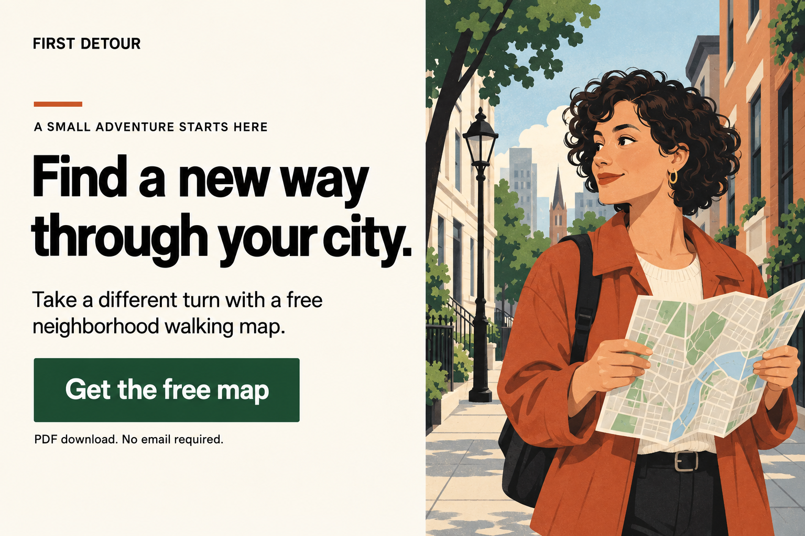
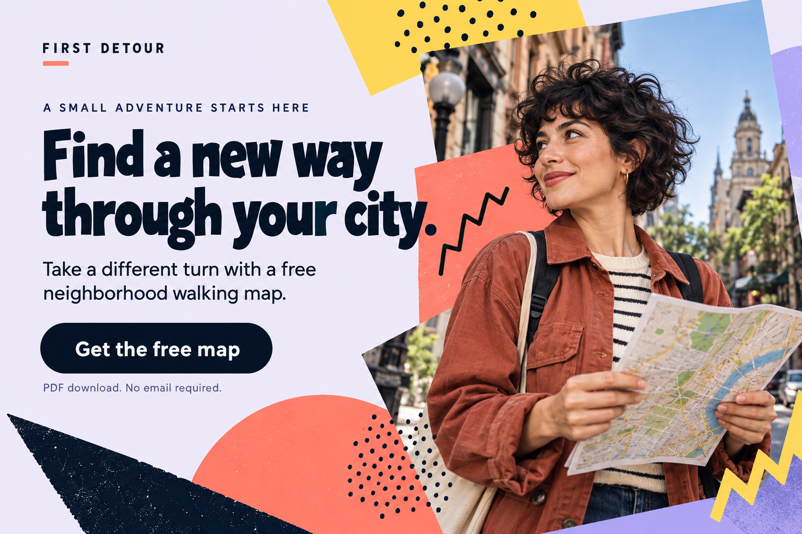
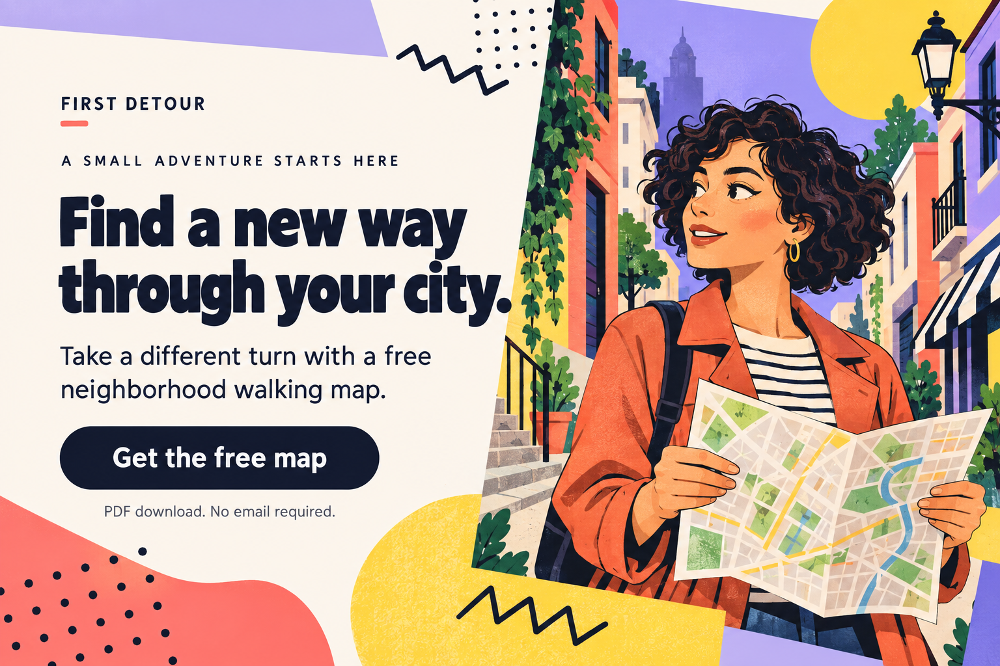

# 5. One brief, four visual treatments

**Optional help.** [Current assignment requirements](../assignment.md) · [Tutorial index](README.md)

[← CTAs](04-persuasion-and-cta.md) · [Home](../README.md) · [Next: build your set →](06-build-and-critique.md)

**You will learn:** how layout and image medium change the same message.

## Shared brief

**FIRST DETOUR** is a fictional Explorer brand for city residents seeking local adventure. It offers a free neighborhood walking map. **Get the free map** is intended to start a PDF download without collecting email. Reciprocity is the intended approach: give useful value first. This is a hypothetical service, not a live offer.

All four images were generated with the built-in image generator. People, photographs, and scenes are synthetic. These are contemporary teaching mockups, not historical artifacts, customer evidence, or tested conversion winners. [Prompts and credits](../reference/sources-and-credits.md).

**This optional gallery shows four treatments to illustrate style and image medium. The assignment requires two designs per archetype, with a third optional.** Separate generations also differ slightly in crop and type: these are illustrative comparisons, not controlled experiments.

## A. Swiss-inspired layout + photographic imagery

**Notice:** repeated left edges, restrained palette, large type, rectangular photo. The map gives the portrait a purpose. Inward gaze connects the composition to the copy. The headline conveys curiosity; supporting text names the free offer.

**Critique:** the face may dominate. Try a smaller portrait or a more visible map if viewers remember the person but cannot explain the offer.

## B. Swiss-inspired layout + illustration

**Notice:** a drawn character and city replace photographic texture while the structured layout remains. Illustration does not require a different archetype or persuasion principle.

**Critique:** the detailed city competes with the map. Simplify the background if the deliverable is unclear. Illustration does not prove a route exists.

## C. Memphis-inspired layout + photographic imagery

**Notice:** cutout portrait, tilted panel, contrasting color fields, and pattern introduce play. A quieter copy area keeps the CTA identifiable. This is a contemporary adaptation of a postmodern vocabulary.

**Critique:** the headline approaches the collage edge. Give it more breathing room at smaller sizes. Protect the button area before adding decoration.

## D. Memphis-inspired layout + illustration

**Notice:** character and setting participate in the visual world. Curiosity comes through the map, glance, and headline, rather than bright color alone.

**Critique:** expressive type and busy scenery may suggest a more playful voice. Check that exploration remains the main promise; simplify if decoration becomes the most memorable part.

## Now change the persuasion

Keep the free map and Explorer brand. A hypothetical **unity** treatment:

> **Headline:** For neighbors who take the long way home.

> **Support:** Explore the place we call home with a free neighborhood walking map.

> **CTA:** Get the free map.

This foregrounds shared local identity while keeping the action. Reciprocity remains present; principles can overlap. Explain what you intend to emphasize and what supporting content would make the community claim meaningful.

You can try this direction in either style. Create your own brief and imagery rather than submitting these tutorial examples.

## Try it

A/B compares medium most closely; A/C compares style with photographic imagery. Name one useful change and one tradeoff. Choose what to borrow for your brief and what to leave out.

**Try it:** use this comparison method to help explain your design choices.
